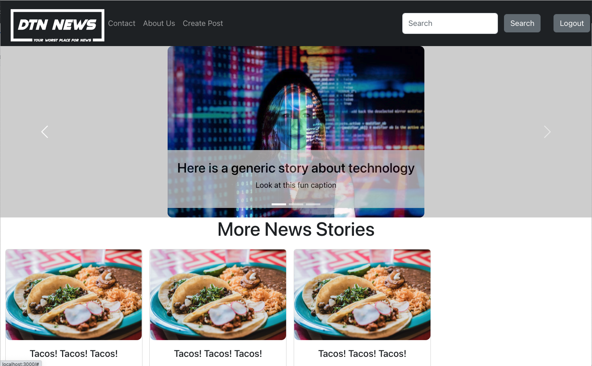

# **DTNS_News_Blog**

## **MERN Stack Project**

### Description
  This is a simple News website. A registered user can signup for an account. Once signed up a user can post a news article.

### Demo

### Technologies
Front End:
  Axios
  Bootstrap
  Common
  React
  React-bootstrap
  React-DOM
  React-Router-DOM
  React-Scripts
  Sass
  Web-vitals

Back End:
  Common
  Cors
  Debug
  Dotenv
  Express
  Express-React-Views
  Mongoose
  Nodemon

### Technical Information
  Fork and clone the repo. Run 'npm install' inside the client folder as well as the server folder. Once all the dependencies are installed run 'npm start' or 'nodemon' inside the client and server folders. Enjoy the best Milestone2 News site in the history of the world.

### Issues
  -Currently there is no database connected online.
  -Posting a new News Article router is not complete
  -Comments are not working

### Front-End

We are using React to create these files

    Commentor account signup
    Apply for a content creator account
    Pages  
      Home Page
        Topics
          Sports
          Coding
          Food
          Travel
          Random
      About Us
      Contact
      Search
      Login
      SignUp
      Logout
    
  
### Back-end

  Database that we are using:
  
    Users 
    
      Category - Creator or Viewer
      First Name
      Last Name
      Email
      Password

    Articles
      
      Author (Creator)
      Title
      Category
      Body
      Picture
  
    Features
    
      Content Creator accounts
      Commentors accounts
      Articles - written, pics, videos, audio
      topic category

